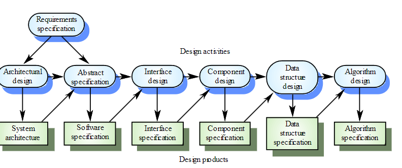
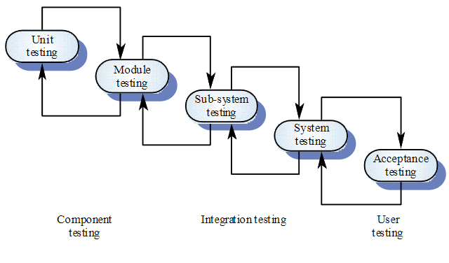

# Software design process

## Qualità del software

La qualità del prodotto:
- Si riferisce alla **funzionalità**, la principale qualità con cui viene costruito un software
- Definita dal **customer**

La qualità del processo:
- Si riferisce al **processo**, ovvero come il sw è sviluppato
- Definita dal team di sviluppo

Assegnare la qualità per quanto riguarda le **functional properties** segue diversi criteri:

- **Correttezza**: il sw fa quello che deve fare, ed è semplice da trovare ed è stabilita parlando con il customer
- **Easy-of-use**: comprende User experience (UX) e documentazione
- **Performance**: include velocità ed efficienza (es memoria, speed, costi energetici etc)
- **Dependability**: quanto ci si può affidare

Quest'ultima misura riguarda la **disponibilità**, **mantenibilità**, **affidabilità** di un sistema.

Le proprietà **non-funzionali** sono:
- **Verificabilità**: possiamo accertarne le caratteristiche
- **Mantenibilità**: possiamo effettuare modifiche in modo semplici
- **Riusabilità**: se è ben impacchettato per nuove applicazioni
- **Portabilità**: se funziona su diversi HW/OS

## Principi del software design

- **Strictness e formalism**
- **Separation of concern**: principio del divide-et-impera
- **Modularità**: viene direttamente dal punto precedente e ci sono due approcci principali:
    1. **Top-down**, view completa del progetto e dividiamo in componenti, usato quando si parte da zero
    2. **Bottom-up**, si sviluppano i componenti specifici e li integriamo man mano, usato quando si devono riutilizzare dei moduli già esistenti
- **Astrazione**: come modellare le varie parti del progetto
- **Costi**: un cattivo design ha un costo elevato nella long run.
- **Manutenzione**: si divide in bugfixing (12-24 mesi free dopo release), performance improvement e cambi nel dominio (come nuova ver di librerie, OS e HW)

## Modellare il processo

Ci sono diversi approcci che dipendono da:
- Tipo di tecnologie
- Tempo disponibile
- Legacy codebase: si parte da zero o si migra
- Company process: tool utilizzati

Il pattern tipico è:
1. Specs
2. Design (da non mischiare con la 1)
3. Implement 
4. Integration (automatizzabile)
5. Test (automatizzabile)
6. Deploy (automatizzabile)
7. Maintenance (da non understimare)

Che andremo a spiegare qui in seguito.

### 1 - Specs

Comprendono domande riguardanti:
- Quale sistema andrebbe usato (funzionale) e come interagisce con l'utente (non funzionale)?
- Su quale ambiente?
- Ci sono legacy codebases o vendor?
- Provare ad immaginare ogni possibile problema per il futuro

Gli esperti in questo campo sono comunemente analisti di business o requirements engineers.

E' importante accordarsi per bene con il customer in modo da stabilire il prezzo, cosa si vuole che il sw faccia e non faccia.

### 2 - Design

Si fa uno sketch di come lavorare:
- Quanto veloce vogliamo un prototipo funzionante
- Si parte da 0 o da legacy code
- Bisogna fare il design di test funzionali

Si prendono decisioni che riguardano:
- Design architetturale
- Scelta del linguaggio / framework
- Scelta del HW
- Piano di integrazione e definizione dei protocolli e dell'infrastruttura

Si sceglie anche un piano per il team e per la collaborazione.

Ci sono diversi tool per disegnare come il sistema dev'essere fatto, tra cui:
- Unified Model Language (**UML**) per comportamento e classi
- Data-Flow Diagrams (**DFD**) se i dati sono il problema principale
- Entity-Relation (**ER**) per lo sviluppo di DB e delle principali operazioni

### 3 - Implementation

Dopo una buona fase di design viene sempre l'implementazione.
C'è un paradigma comune a molte applicazioni:
1. Dobbiamo salvare alcuni dati, **CRUD**:
    - create, read, update, delete
    - http(s)
2. Dobbiamo processare questi dati
3. Dobbiamo renderli disponibili su un interfaccia (web, ux, rest)

Non c'è bisogno di reinventare la ruota e ci sono migliaia di framework disponibili che ci aiutano ad implementare cose.

### 4 - Integrazione

E' il processo di riunire le diverse parti che compongono il SW, dette componenti/moduli/servizi, si basa sul concetto di divide-et-impera. 

### 5 - Testing e validation

Dobbiamo ovviamente verificare che il nostro SW rispetti le specifiche e i requisiti, sia funzionali che non. 
Ci si basa sul concetto di **test cases** e **scenarios** a diversi livelli di astrazione. 
Ad esempio si fa prima **testing in large**, ovvero si isolano un alto numero di test cases basati su specifiche functional che permettono al customer di dire se funziona correttamente e, in seguito, si passa al **testing in small** che consiste nell'isolare dei test case minori per componenti specifiche

Solitamente si fa prima **unit testing** (single component), poi si passa a **module testing**, insieme di units. In seguito **integration testing**, ovvero test che assicurano che component diversi possano lavorare insieme senza problemi. Infine abbiamo il **functional testing** che include il customer e deve assicurare che tutto ciò che è scritto nel **requirements document** sia rispettato.

### 6 - Deploy

Approccio **Continuos Integration** - **Continuos Delivery**, che consiste nel integrare spesso allo scopo di ridurre merge conflict e testare con automated test i vari componenti aggiunti man mano e pubblicarli in maniera continua sempre con test che verificano che non ci siano problemi per il production (**CI/CD**)

### 7 - Maintenance

E' il processo di modificare o estendere il SW dopo il primo release accordato con il customer. Dipende dal contratto, il debug è sempre incluso per 6 mesi o il primo/secondo anno. 