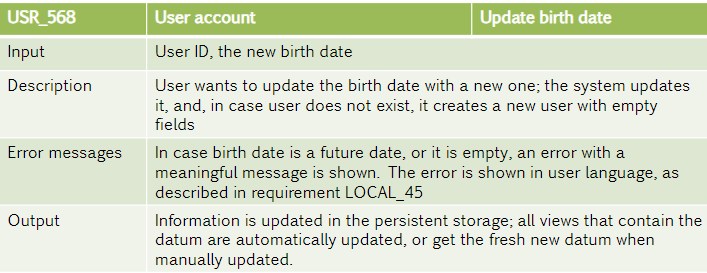

# Requirements and specs

## Specs

Le specifiche sono un **contratto** tra lo sviluppatore e il customer:
- Prima si decide cosa il sistema deve fare e si deriva un insieme di requisiti. 
- Dopo per ogni fase del flusso di sviluppo si creano un insieme di requirements più dettagliato

Quest'ultimi vengono accordati tra designers e developers e il customer non ne ha nulla a che fare, a meno che non abbia qualche tipo di esperienza nel settore. 

Le **specifiche** ci dicono **cosa** il sistema deve fare, mentre l'**implementazione** **come** farle, tipicamente si usa un approccio top-down e si includono moduli esistenti.

Ad esempio:
**WHAT**: gli user si devono autenticare nel sistema
**HOW**: ha diversi livelli di dettaglio: 
1. gli user devono inserire i loro dati in un form? che tipo di form?
2. gli user devono inserire la psw in un field offuscato nel webform e cliccare submit?
3. i dati vengono trasmessi a un service che ritorna 400 se "age == null"
4. e così via

## Requirements

I requirements sono classificati in:
- **Functionality**
- **Usability**
- **Reliability**
- **Performance**
- **Supportability**

Il **SRS** (SW req specification) è un documento standardizzato che parla solo di requirements e non dell'implementazione o della qualità del codice, dev'essere corretto, non ambiguo (must/not), completo, ordinato e verificabile (metriche e key performance indicators kpi).

### 1 Introduction
#### 1.1 Purpose
Qual è il goal principale e il pubblico.
#### 1.2 Scope
- Nome del prodotto
- Goals
- Benefits
- What are we solving
- What we arent solving
- What is it to be done in the future
#### 1.3 Definitions and acronyms
Lista di defs e dizionario a forma di tabella per acronimi
#### 1.4 References
Può anche essere nell'appendix
#### 1.5 Overview
Breve riassunto che va attraverso ogni sezione

### 2 General Description
In questa sezione vengono descritte le feature principali del sistema e i vincoli che deve rispettare.
#### 2.1.1 Interfaccia di sistema
Che framework e middleware stiamo usando, anche che server etc
#### 2.1.2 Interfaccia utente
WebApi, WebForm etc
#### 2.1.3 Interfaccia HW
Come viene configurato l'HW
#### 2.1.4 Interfaccia SW
Quali librerie vengono usate e come si interfaccia con altri sistemi e servizi
#### 2.1.5 Interfaccia di comunicazione
Che protocollo usiamo, ad es TCP/IP, MQTT
#### 2.1.6 Reqs di memoria
Ad esempio se si lavora in sistemi embedded con bassa capacità
#### 2.1.7 Inizializzazione, backup e recovery
#### 2.1.8 Installazione e config
Configurazioni iniziali, ma anche a livello di sicurezza ad esempio DMZ e gateways.
#### 2.2 Funzionalità del prodotto
Cosa fa il sistema, senza entrare troppo nel dettaglio
#### 2.3 Caratteristiche utente
L'utente è nuovo al campo o esperto? Avrà bisogno di un allenamento per poter utilizzare il sistema e nel caso c'è bisogno di un costo aggiuntivo?
#### 2.4 Limiti generali
Riguardanti funzioni e performance, ad esempio è un sistema sincrono o parallelo? O altri tipi di criticità.
#### 2.5 Assunzioni e dipendenze
Si parte da un sistema esistente? Ci vuole qualche conoscenza di base o licenza?
#### 2.6 Porzionamento dei req
Chi lavora e su cosa, in modo che si abbia il tempo di preparare le conoscenze necessarie

### Requirements Funzionali e Non
#### 3.1 Interfaccia di sistema (o frontend)
Definisce in modo specifico quello che è annunciato in **2.1** e **2.2**. Si fa riferimento ai formati di  input e degli output e ai protocolli
#### 3.2 Requirements funzionali
Ogni requirement ha una tabella dedicata (o una riga in una tabella). Si ha sempre un contesto per ognuno, degli input e output e una descrizione che comprende:
- Formato dei dati
- Operazioni eseguite
- Error handling
- Expected output

Ad esempio:

#### 3.3 Requirements non funzionali
#### 3.3.1 Requirements di performance
Quanti accessi concorrenti o quanti utenti salvati?
#### 3.3.2 Database / Storage
Abbiamo dei limiti tecnici?
#### 3.3.3 Limiti generali
Abbiamo ad aderire a un qualche standard, oppure abbiamo limiti riguardanti OS o HW o un qualche linguaggio di programmazione?
#### 3.3.3 Attributi di sistema 
Tra cui abbiamo affidabilità, accessibilità, sicurezza, mantenibilità e portabilità
#### 3.3.5 Altri requisiti
Come la scalabilità

### Appendix 
Tutto ciò che non è essenziale dovrebbe andare nell'appendie, ad esempio stiamo usando AWS, ma non è essenziale sapere tutto di AWS nella sezione 2 o 3, quindi semplicemente si allega il link alla guida di AWS nella appendix. 