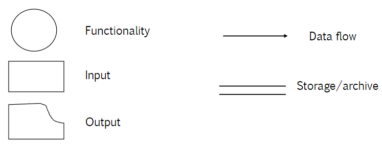
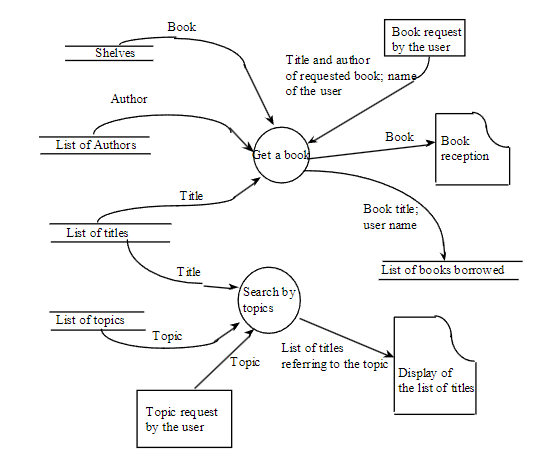

# Documentazione

## Tool e diagrammi

Le specifiche sono un contratto tra customer e sviluppatore e per scriverlo si usano dei tool e modelli ben conosciuti, tipicamente si dividono in:
- Diagrammi operazionali (DataFlow, UML, FSM etc)
- Diagrammi strutturali (E/R)

### Data Flow Diagrams
Descrivono le funzionalità, input e output, racchiusi tutti in dei nodi (con shape diverse) e il flusso dei dati con gli archi che collegano i nodi. Inoltre viene rapprsentato in modo diverso gli storage (doppia linea). In seguito un'immagine che spiega la simbologia:

e un esempio di DFD:

I DFD non sono **standardizzati**:
- **Pros**: sono estremamente semplici e tutti li usano proprio per questa facilità
- **Cons**: sono informali, non sono operazionali, ovvero non possono specificare il Control Flow (inteso come i branch)

### UML

Appunti dedicati nella prossima lezione (05)

### Finate State Machines

Diagramma in cui ogni stato è un nodo e ogni arco rappresenta il cambio di stato. Basta pensare all'esempio del distributore automatico, fatto nella prima sezione del corso di Architettura dei Calcolatori.

Abbiamo quindi una quintupla:
$
    FSM = (\sum, S, s_0 \in S, S_f \subset S, t: S \times V \longrightarrow S)   
$

dove:
- $\sum$ è l'alfabeto
- $S$ è l'insieme di stati non vuoti
- $s_0\in S$ è lo stato iniziale
- $S_f\subset S$ è l'insieme di stati finali
- $t: S \times V \longrightarrow S$ è la funzione di transizione di stato

### Petri nets
Modella il comportamento di un'applicazione tramite un grafo bipartito:
- Le **transizioni** sono triggerate dagli **eventi** (barre)
- I **places**, ad esempio condizioni (cerchi)
- Gli archi specificano quali **places** si trovano **prima o dopo le condizioni** per gli eventi
- Ogni place colleziona **tokens** (punti) che potrebbero triggerare un evento