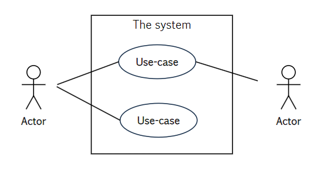
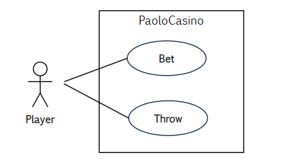
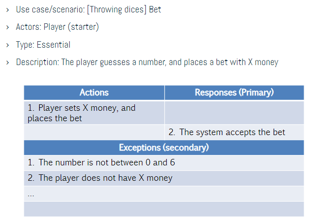
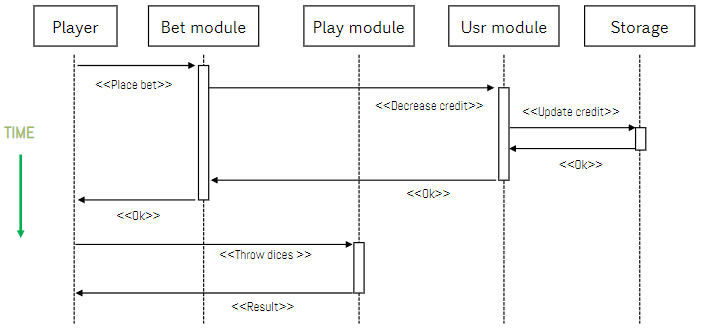

# Unified Model Language

## Intro

E' un linguaggio nato ufficialmente nel 2005, che serve principalmente per il design:
- Ha una notazione semi-standard basata su meta-descrizioni di entità in un sistema software
- Ha notazione grafica
- Supporta l'approccio divide-et-impera

E' utile in quanto:
- Può modellare diversi livelli di astrazione e fasi di sviluppo, si passa da specifiche a classi singole
- Lavora sia con il bottom-up che con il top-down
- E' indipendente dal linguaggio che si decide di utilizzare

Ci sono tre macro aree:
- **Entities** tra le quali troviamo
    1. Classi e interfacce
    2. Comporamenti
    3. Grouppi e packages
    4. Notazioni e info generali
- **Relazioni** come:
    1. Associazioni
    2. Dipendenze
    3. Generalizzazioni
    4. Implementazioni
- **Diagrammi** come:
    1. Stesso oggetto, ma prospettiva diversa
    2. Rappresentazione parziale per vedere le cose sono una luce diversa

I diagrammi UML possono essere:
- **Strutturali**, con diagrammi per use-cases e scenari, ma anche con notazioni per classi, oggetti, packages e componenti (da OOP)
- **Comportamentali**, con diagrammi per le sequenze, stati e attività

## Use-case Diagrams

Descrivono le interazioni tra il sistema e gli altri attori, come utenti e sistemi esterni. Possono essere immagini o tabelle e viene modellato il comportamento aspettato, sono utili per test funzionali e verifiche, ma non sono considerabili requirements.
Vogliamo identificare chiaramente 
- i limiti del sistema
- le entità
- gli use-case scenarios

La notazione è grafica

Ricordarsi che gli "attori" sono esterni al sistema, anche se li modelliamo non sono sotto il nostro controllo, l'unica cosa su cui abbiamo il controllo è il modo in cui interagiscono internamente con il sistema.
Si definiscono poi diversi scenari, ognuno per una singola istanza di use-case, dove viene descritta la sequenza di eventi che potrebbero accadere, che andrà a definire il test da fare all'utente.
Si distingue tra:
- **Main scenarios** -  bisogna assicurarsi che tutto funzioni perfettamente
- **Secondary scenarios** - sono parti opzionali

Uno **scenario** descrive come il sistema interagisce con l'esterno e tipicamente specifichiamo:
- Pre e post condizioni (es cambio di stato)
- Certezze da dare e da assumere (reliability, QoS)
- I trigger agli eventi

### Esempio Paolo's Casino

**Use-Case**: gli utenti possono lanciare i dadi:
1. L'utente può scommettere
2. L'utente può tirare i dadi

Abbiamo bisogno di una descrizione a tabella per accompagnare l'immagine, che abbia:
- ID univoco
- Titolo
- Attori
- Pre-conds
- Sequenza di eventi (trigger e risposte)
- Post-conds ed eccezioni

Per quanto riguarda le relazioni abbiamo dei collegamenti tra gli attori e gli use-case tra cui generalizzazioni, inclusioni ed estensioni:
- Nell'esempio potremmo come **generalizzazione** un player con free tier e un player con subscription, che viene dalla generalizzazione di player, ovvero ha gli stessi use-case ai quali si aggiunge _edit bet_ che gli permette di customizzare la bet classica che ha anche il free tier. Possono quindi avvenire tra **UC** o tra **Actors**
- Le **estensioni** invece servono a definire le dipendenze, nel nostro caso un player prima fa la scommessa e solo dopo lancia i dadi, quindi **bet \<\<extends\>\> throw**.
- Le **inclusioni** servono ad esprimere il riutilizzo dei gruppi, ad esempio possiamo giocare e scommettere anche con le carte e non solo con i dadi, quindi **bet \<\<includes\>\> throw, draw**

Ci sono due modi _iterativi_ di lavorare:
- **Actor-based** - per ogni attore si modella l'interazione
- **Process-based** - per ogni interazione si identificano gli attori

## Sequence Diagrams

Si concentrano sugli attori e i dati che scambiano con il sistema, descrivendo l'interazione e il significato dei dati e dei messaggi, affiancando il tutto ad una timeline dello scenario

Gli oggetti sono i rettangoli sopra, possono essere:
- Attori (player)
- Moduli (bet, play, usr)
- Classi (none here)
- DBs (storage)

Per ogni oggetto c'è una **lifeline** che rappresenta quando una entità esiste e su questa si possono piazzare dei rettangoli detti **Focus of control**, che descrivono le interazioni in modo sincrono.
A collegare quest'ultimi abbiamo gli **Stimula**, ovvero frecce che rappresentano chiamate e invocazioni con una breve descrizione, le chiamate sono linee continue, le risposte sono a tratti. Non è necessario modellare i dati trasferiti. Ci sono frecce diverse per le chiamate asincrone. Gli **stimula** quindi astraggono i messaggi, che rapprsentano le azioni, come chiamate, return, send, create e destroy.
Tra i tipi di messaggio abbiamo:
- Per gli oggetti costruttori e distruttori
- Read queries
- Update
- Trigger an action
- Iterative (ad esempio se lavoriamo con liste etc)

Ad esempio i verbi HTTP (CRUD).

Per quanto riguarda l'**esecuzione condizionale** abbiamo che gli IFs sono rappresentati con $[cond]$ dove cond è la condizione, ad esempio $[Bet > 0]\longrightarrow \mathbf{Send}$ o $[Bet <= 0] \longrightarrow \mathbf{Log Error}$ 

Per i **loop** invece la notazione è $\star[n]$ dove _n_ potrebbe ad esempio essere la dimensione di un array. Nel nostro esempio potremmo piazzare diverse scommesse in base al contenuto di una lista, quindi si itera sulla lunghezza della lista e si chiama molteplici volte lo stimula "Place".

La **ricorsione** è indicata con una freccia che parte da un Focus of control che torna a se stesso.