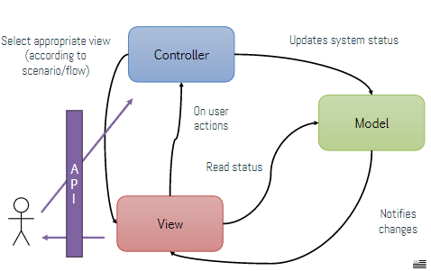

# System architecture and design

L'obiettivo di questo step è:
- Identificare un insieme di moduli
- Ogni modulo ha una specifica funzionalità (o subfunzionalità)
- Dobbiamo descrivere le loro interazioni con altri moduli 

Per fare ciò abbiamo bisogno della **decomposizione**, dapprima in **sottosistemi**, che interagiscono tra loro, ma senza dipendenze gli uni con gli altri. In seguito in **moduli** e sotto-moduli, ognuno che provvede a un servizio specifico per gli altri moduli. Infine in componenti, le unità base della implementazione (ad esempio le librerie Java).

Un concetto importante è l'identificazione e l'assegnamento del **Controllo**, ovvero chi fa cosa.

## Moduli

Raggruppano le funzionalità che sono in una relazione, ad esempio tutto ciò che riguarda l'account di un utente (CRUD). A livello di system design dobbiamo rendere chiare le interfacce verso gli altri moduli.

Le relazione tra i vari moduli sono di **use**, **composed by** e **depends**. Questo perchè i moduli possono usare altri moduli per essere completi, possono essere composti da più sotto-moduli e possono dipendere da altri moduli.

Ci sono due strategie di partizionamento, come al solito:
- **Top-down**: dalle specifiche ai servizi, components e moduli. Si parte dalla documentazione
- **Bottom-up**: si parte dalle data structure e funzionalità se ovviamente abbiamo già una codebase esistente (legacy)

Ovviamente si possono mischiare gli approcci andando avanti con il progetto.

## Pattern Architetturali

### Client-server architecture

Tipica dei sistemi distibuiti e si compone di:
- Uno o più servers che offrono servizi (come account, storage, logics per il customer)
- Clients che usano i servizi (web-apps, mobile apps etc)
- Network di comunicazione (con comunicazione asimmetrica basata sulle req e res)

I **pros** sono:
- E' semplice distribuire dati e responsabilità
- Può scalare facilmente con il numero di clients
- Può scalare facilmente con il numero di server (sia aumentando il numero di macchine, che le loro risorse)

I **contro** sono invece:
- Tipicamente richiede molte risorse e può essere ridondante
- I server devono essere conosciuti dai client
- Creiamo dipendenze (cosa succede se cambiamo URLs?)

### Design of control

Con controllo si intende "Chi fa cosa?", più in particolare chi runna gli use-cases e chi ha la logica che li implementa. Basta seguire le barre verticali nei sequence diagrams e può essere di due tipi:

#### 1) Centralized control (sincrono)

Un singolo sistema serve tutte le richieste:
- dipende dagli altri sottosistemi
- usato quando si fa design del frontend di una web-app
- basato su comunicazione sincrona, come function calls

Il problema/pro è che ha un **single point of failure** e un **single point of access**, basta pensare al meccanismo req-res, che si basa sulle chiamate di funzione, quindi ci sarà sempre un singolo entry (main). Nei sistemi paralleli esiste invece il concetto di master-slave, dove abbiamo un sistem controller al centro di diversi processi, come l'interfaccia utente, un processo di computazione e un gestore degli errori.

### 2) Event-based (asincrono)

Il modulo di ogni sotto-sistema lavora in modo indipendente, senza il bisogno di conoscere gli altri, si basa su comunicazione asincrona.
Come svantaggio abbiamo che è un sistema distribuito, difficile da implementare, però le interazioni tra i moduli sono più slegate e si ottiene quindi robustezza, infatti sono rimosse così molte dipendenze. In generale in informatica le dipendenze sono un grosso problema.

Gli interrupts (interruzioni) sono segnali che indicano al processore di interrompere l'esecuzione del codice corrente per gestire un evento specifico. Gli interrupts possono essere generati da hardware (come periferiche) o software (come eccezioni o condizioni di errore).

## Specifiche modulo

Una volta scelto il modello architetturale si scrivono le specs per il single module.
I principi base sono:
- ogni modulo dev'essere al massimo dell'indipendenza dagli altri
- Ci deve essere la minima conoscenza inter-module richiesta dagli sviluppatori
- I serivizi molto dipendenti devono appartenere allo stesso modulo 

Prima di tutto si deve stipulare il contratto tra i moduli, non usiamo la parola interface perchè potrebbe trarre in inganno.
Solitamente per il contratto (interfaccia) si devono definire (possibilmente in UML):
- quali funzionalità mettiamo in esposizione (ad esempio update age o delete user
- come le esponiamo (funzioni da invocare, eventi da triggerare)
- input-output parameters (numero e tipi ad esempio)

UML provvede la stessa notazione sia per l'analisi che per il design e l'implementazione (diversi livelli di astrazione chiaramente)

## MVC

Il papà di tutti i tipi di modulo è MVC, ovvero:
- M -> Model, rappresenta lo stato dell'applicazione, ovvero come rappresentiamo il mondo, come lo salviamo e come lo comunichiamo
- V -> View, ovvero come mostriamo il modello, fondamentalmente rappresenta l'interfaccia
- C -> Control, la logica dell'applicazione, ovvero come andiamo a modificare il modello, basta leggere i diagrammi comportamentali.

Questo è un ottimo modo di partizionare un modulo, e dovremmo avere model, view e control in file diversi per buona pratica, o ancora meglio in package diversi

Tra i pro dell'MVC abbiamo l'isolamento dei component che migliora la riusabilità, mentre tra i contro, l'aumento di complessità della struttura, anche se non è un grosso problema.